# Procesverslag
Markdown is een simpele manier om HTML te schrijven.  
Markdown cheat cheet: [Hulp bij het schrijven van Markdown](https://github.com/adam-p/markdown-here/wiki/Markdown-Cheatsheet).

Nb. De standaardstructuur en de spartaanse opmaak van de README.md zijn helemaal prima. Het gaat om de inhoud van je procesverslag. Besteedt de tijd voor pracht en praal aan je website.

Nb. Door *open* toe te voegen aan een *details* element kun je deze standaard open zetten. Fijn om dat steeds voor de relevante stuk(ken) te doen.

## Jij

  
uitwerken voor kick-off werkgroep

  ### Auteur:
  Irem Erdem 

  #### Je startniveau:
  Blauw

  #### Je focus:
  responsive
 

## Je website

  
uitwerken voor kick-off werkgroep
  

  ### Je opdracht:
  https://www.aesop.com/fr/en/?gclid=CjwKCAjwo9unBhBTEiwAipC11zuE-jGY17nXoKiKNIlWxazzan8QVTTKspWn5ze9AgTitxD8Y2tmFhoCVgIQAvD_BwE&gclsrc=aw.ds

  #### Screenshot(s) van de eerste pagina (small screen): 
  Aesop home  
  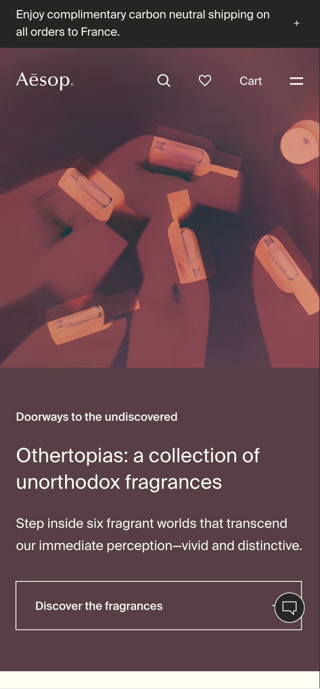

  #### Screenshot(s) van de tweede pagina (small screen):
  Hydrate 
  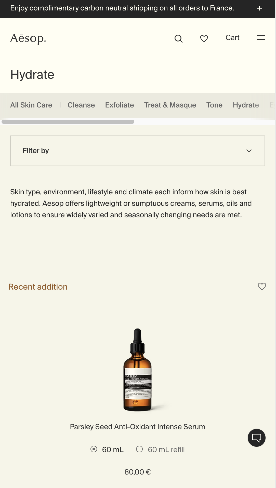
 

## Toegankelijkheidstest 1/2 (week 1)

  
uitwerken na test in 2e werkgroep

  ### Bevindingen
  Lijst met je bevindingen die in de test naar voren kwamen: 
  -Sommige buttons hebben geen omschrijving, geen alt. 
  -De taal van de website is Engels maar bij bijvoorbeeld Franse woordjes staat er niet bij dat dit in het Frans uitgesperoken moet worden.
  -Je kan gewoon inzoomen in de website. 
  -De website bevat geen complexe images dus is er geen behoevte aan alternatieve tekst voor zulke plaatjes. 
  -De heading elementen worden goed en correct gebruikt. 
  -Alle fotos hebben een alternatieve tekst.  

## Breakdownschets (week 1)

  
uitwerken na afloop 3e werkgroep

  ### de hele pagina: 
  
  

  ### dynamisch deel (bijv menu): 
 

  ### wellicht nog een dynamisch deel (bijv filter): 
  

## Voortgang 1 (week 2)

  
uitwerken voor 1e voortgang

  ### Stand van zaken
  
Ik heb moeite met de woorden OP de foto te zetten.
 
  
  
Ik moet nog even kijken hoe ik de carousel ga aanpakken, ik denk dat ik er moeite mee zal hebben
 
  

  ### Agenda voor meeting
  samen met je groepje opstellen

  | student 1 Zahra                           | student 2  Tristan      
  | We willen allebei                         | ---                
  | weten hoe we de                           | en dit             
  | iconen moeten doen.                       | dit als er tijd is 
  | Met fotos of op een andere manier?        | ...                

  ### Verslag van meeting
  hier na afloop snel de uitkomsten van de meeting vastleggen

  - punt 1: Elke pagina een andere titel.
  - punt 2: Favorietenlijst moet ook in de header.
  - punt 3: ./ voor elke link.
  - punt 4: Consistent zijn met waar ik ruimte laat met enter en waar niet. 
  - punt 5: In section is de volgore; eerst header dan p dan img. dus dat moet ik aanpassen
  - punt 6: De sectin dan aanpassen met display flex en dan order.
  - punt 7: Button moet weg want die mag ik niet gebruiken als link. 
  - punt 8: Elke section moet een heading.
  - punt 9: De slider eerst correct html'en met ul en dan alle items. 
  - punt 10: Eelke li een foto dan 1 p met een span voor titel. 
  - punt 11: Het hartje van mn favorietenlijst mag een img zijn.

## Voortgang 2 (week 3)

  
uitwerken voor 2e voortgang

  ### Stand van zaken
  Het meest lastige was de letterfonts goed doen. Ik ben er heel lang mee bezig geweest maar het is eindelijk gelukt. 
  Doordat ik de les over positions had gevolgd ging dat nu heel goed. Het is mij gelukt om de ul li op de img te zetten. 
  Ik moet nu focussen oo mn tweede pagina. 

  ### Agenda voor meeting
  samen met je groepje opstellen

  | student 1 Zahra                       | student 2 Tristan         
  | Tekst onder foto, staan nu 
  |bij zijkant maar moet er onder
  |Ik wil maar 4 colommen als ik 
  |site vergroot hoe doe ik dat
  |Hoe stop ik de woorden in menu 
  |knop. Als ik site groter maak 
  |moet er tekst bij komen in de footer                         
              

  ### Verslag van meeting
  hier na afloop snel de uitkomsten van de meeting vastleggen

  - punt 1 mn plaatje van een hartje verandere eerst niet van kleur, nu heb ik geleerd dat ik filter: invert kan gebruiken hiervoor.
  - punt 2 Iets niet zin maar wel in screenreaer: left:-999
  - punt 3 Flexbox kan ik gebruiken om mijn footer te fixen. 
  - punt 4 Serum filter moet mee als ik naar beneden scroll, dit kan ik nuu door position sticky,en de sections moet ik evranderen omdat het nu alleen een stukje meegaat odat die section daar stopt. dus de html even aanpassen. 
  - Ik heb nu geleerd hoe ik een hamburgermenu aan moet pakken. 

## Toegankelijkheidstest 2/2 (week 4)

  
uitwerken na test in 9e werkgroep

  ### Bevindingen
  Lijst met je bevindingen die in de test naar voren kwamen (geef ook aan wat er verbeterd is):
  -mijn focus states zijn niet altijd duidelijk blijkbaar. 
  -alt tekst bevat niet alle tekst op het plaatje.
  -screenreader skipt soms heading levels.
  -Links zijn niet duidelijk te onderscheiden van buttons. 

## Voortgang 3 (week 4)

  
uitwerken voor 3e voortgang

  ### Stand van zaken
  hier dit ging goed & dit was lastig (neem ook screenshots op van delen van je website en code)
  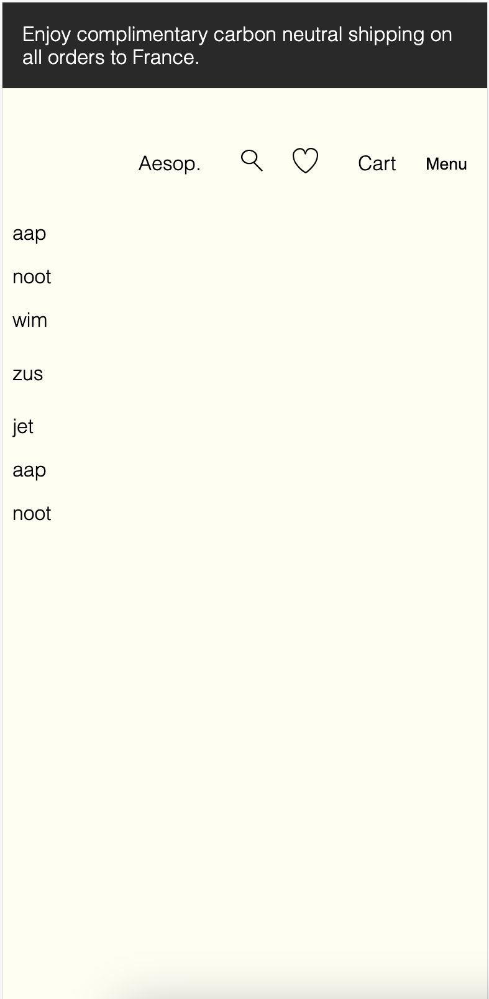Ik had eerst een proleem met mijn hamburgermenu. Na het openen moest de tekst zwart worden anders kan je het niet zin. Dat is nu gefixt met filter:invert(1);
  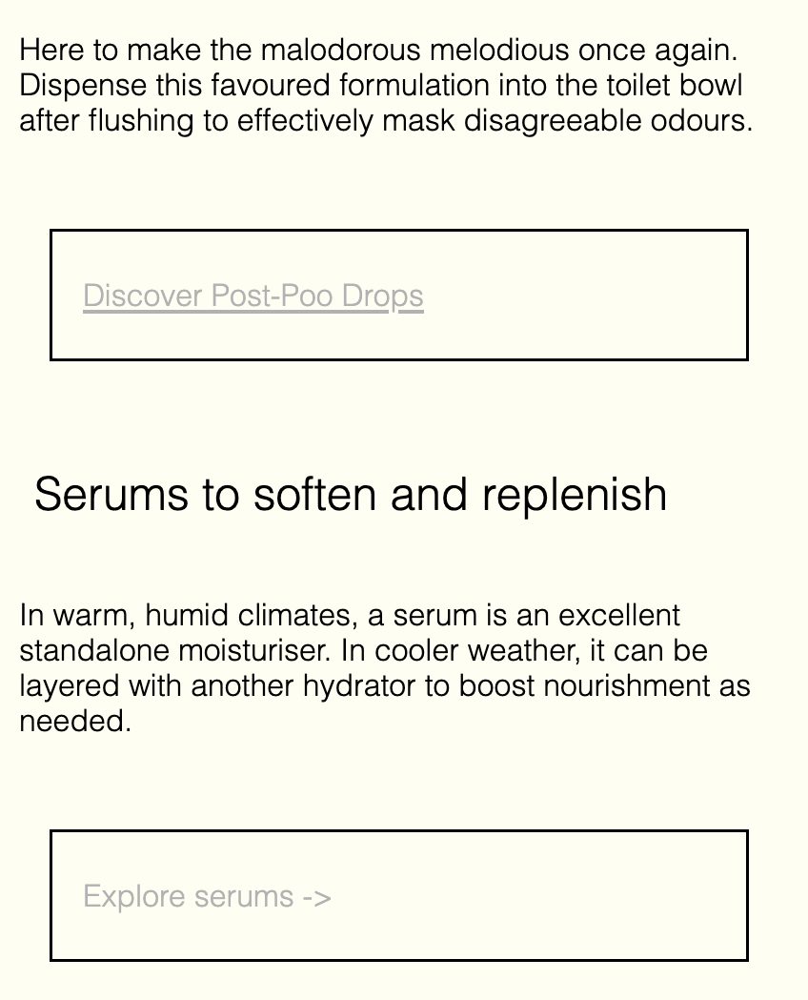De 'visited' states gaan goed, de rest moet ik nog verbeteren, vooral de focused. 
  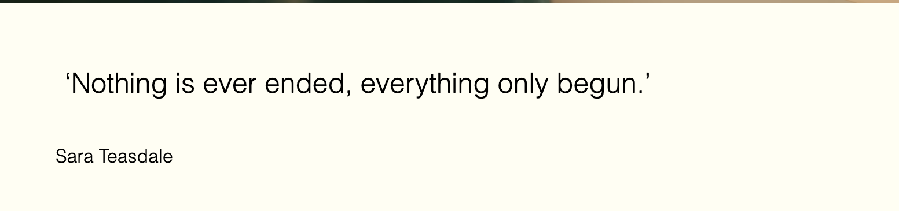Ik kan @media nu veel makkelijker gebruiken. Eerst wist ik niet eens hoe je iets responsive moest maken maar nu kan ik het wel. Hier een voorbeeld van dat ik de tekst meer padding geeft wnr je het vergroot tot de desktop. 
  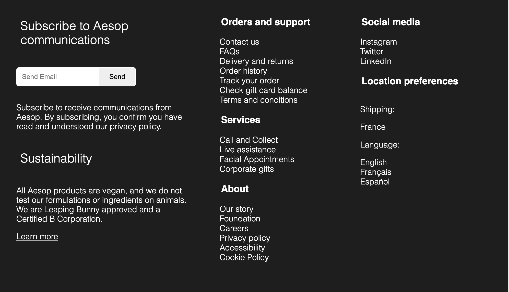Ik had wat moeite met mijn footer omdat ik 2 kolommen wilde aan de rechterkant. Ik heb geleerd dat ik daarvoor flex-direction: column; kan gebruiken. 

  ### Agenda voor meeting
  samen met je groepje opstellen

  | student 1                      | student 2          
  | ---                            | ---                
  | Bij footer                      hoe krijg je lijnen tussen de li, hoe krij ik dat de header tevoorschijn komt zodra ik naar boven scrols
  section p hoort
  als site kleiner
  is niet te zien
  zijn maar dat
  gebeurt niet
  alleen als 
  static weg is 
  maar dan te groot,
  Menu button wil niet boven komen, 
  Header iconen willen niet uit elkaar,
  Hoe hover ik over img dat er dan een andere komt 

  ### Verslag van meeting
  hier na afloop snel de uitkomsten van de meeting vastleggen

  - punt 1 De visual code validator is niet genoeg, ook nog valiuderen op een andere site. 
  - punt 2 screenreader problemen kan ik blijkbaar fixen via de instellingen. 
  - punt 3 Ik kan de section in een andere section doen en die apart van elkaar een positie geven om uiteindelijk de woorden op de foto te kunne plaatsen. 
  - punt 4 Sections mag ik classes geven als ze groot zijn, kleine sections moeten ik nth-child voor gebruiken in css. 
  - punt 5 De button states hoef ik geen visited state bij t doen omdat mjn website dat niet heeft. De andere states wel. 

## Eindgesprek (week 5)

  
uitwerken voor eindgesprek

  ### Je uitkomst - karakteristiek screenshots:
  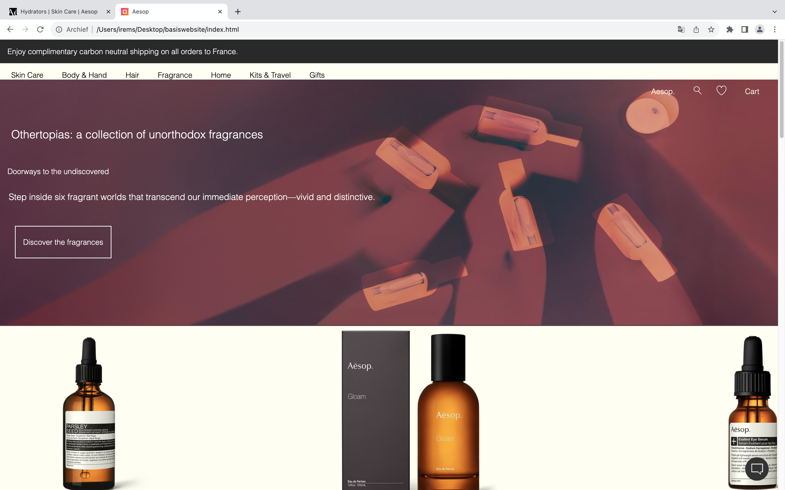
  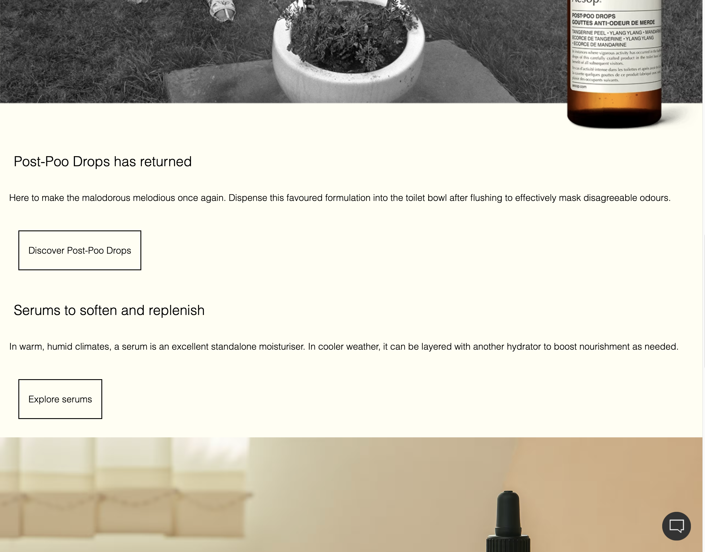
  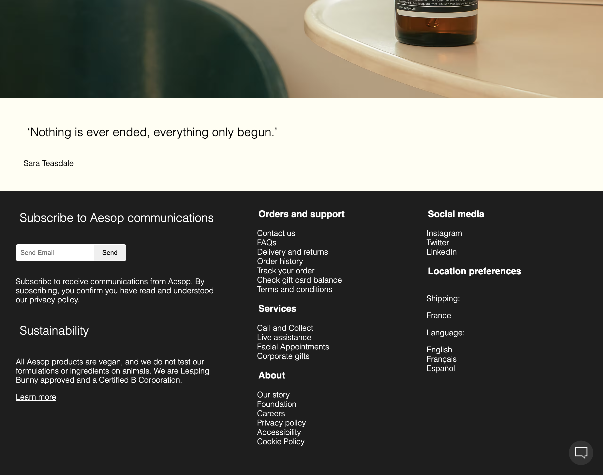

  ### Dit ging goed/Heb ik geleerd: 
  Korte omschrijving met plaatjes
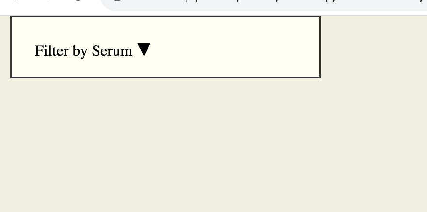De sticky positioning ging goed vooral nadat ik de sections een beetje had aangepast. Nu snap ik waar het probleem lag. 
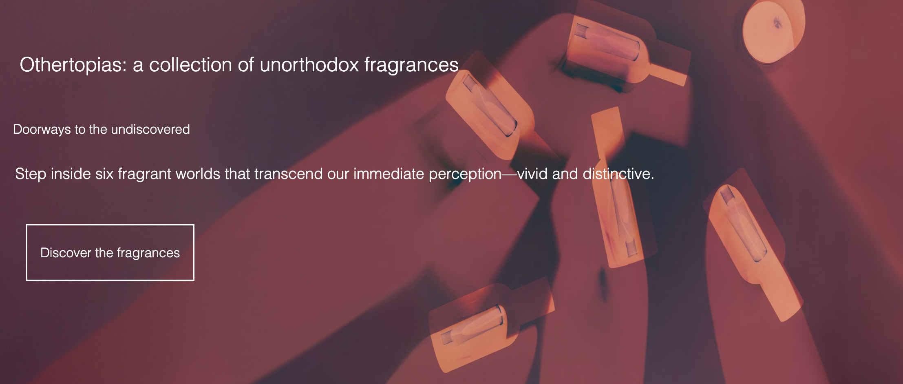Ik heb eindelijk de tekst op de foto kunnen zette. Dit ging heel lang niet goed mar het is gelukt. 
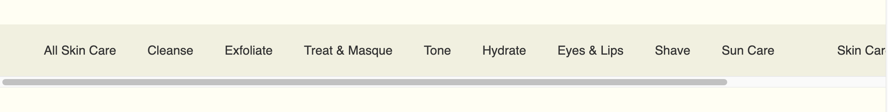Sliders waren best gemakkelijk en dat ging dus goed. 
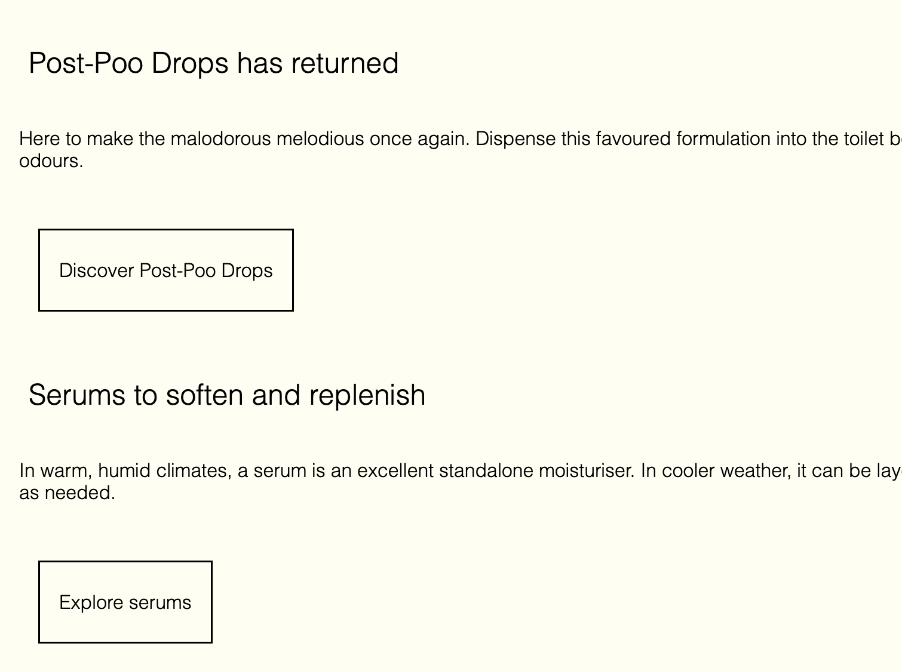De buttons die kleiner meoten wprden zodra het scherm groter woprdt, gingen heel goed op mn home pagina. 
  

  ### Dit was lastig/Is niet gelukt:
  Korte omschrijving met plaatjes
  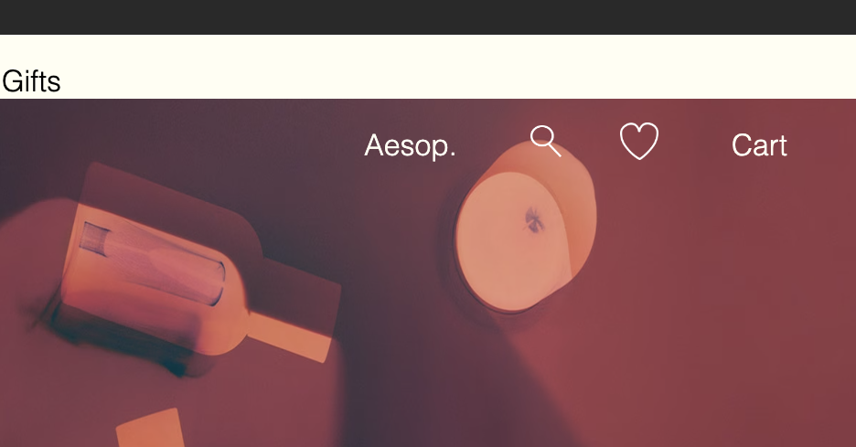Het was me op een gegeven moment gelukt om deze li naast de andere li te zetten op het witte vlakte, maar ik kon op een of andere manier de kleur van de tekst neit aanpassen dus het was niet te lezen. Ik heb het dus terug gehaald naar beneden. 
  Op mn tweede pagina gingen de buttons helemaal niet zo makkelijk als op de eerste pagina, dus heb ik eht echt een width moeten geven. 
  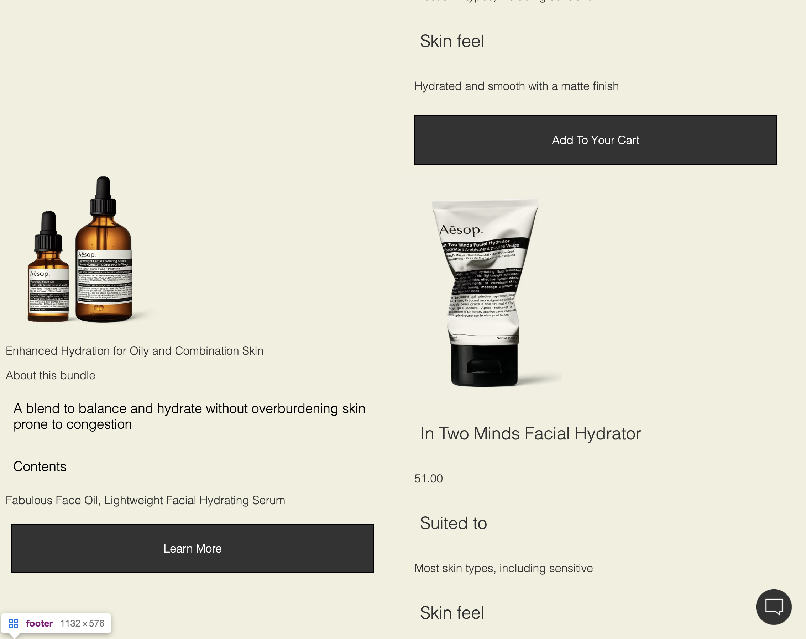ik kon de sections niet goed zetten op de pagina zoals het hoporde, maar met hulp is dat gelukt. Ikzelf struggelde hier veel mee. 

 

## Bronnenlijst

  
continu bijhouden terwijl je werkt

  Nb. Wees specifiek ('css-tricks' als bron is bijv. niet specifiek genoeg). 
  Nb. ChatGpT en andere AI horen er ook bij.
  Nb. Vermeld de bronnen ook in je code.

  1. bron 1 https://css-tricks.com/snippets/css/complete-guide-grid/ 
  2. bron 2 https://www.w3schools.com/css/css_display_visibility.asp 
  3. bron 3 https://codepen.io/shooft/pen/bGONoKa
  3. bron 3 https://codepen.io/shooft/pen/KKbwmao
  4. bron 4 https://codepen.io/shooft/pen/rNoaVoE
  5. bron 5 https://codepen.io/shooft/pen/qBLxdzP
  6. bron 6 https://www.w3schools.com/cssref/css3_pr_mediaquery.php
  7. bron 7 https://codepen.io/shooft/pen/qBLxdym
  8. bron 8  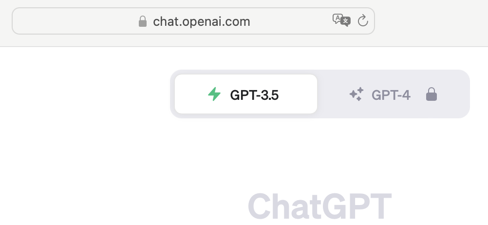

