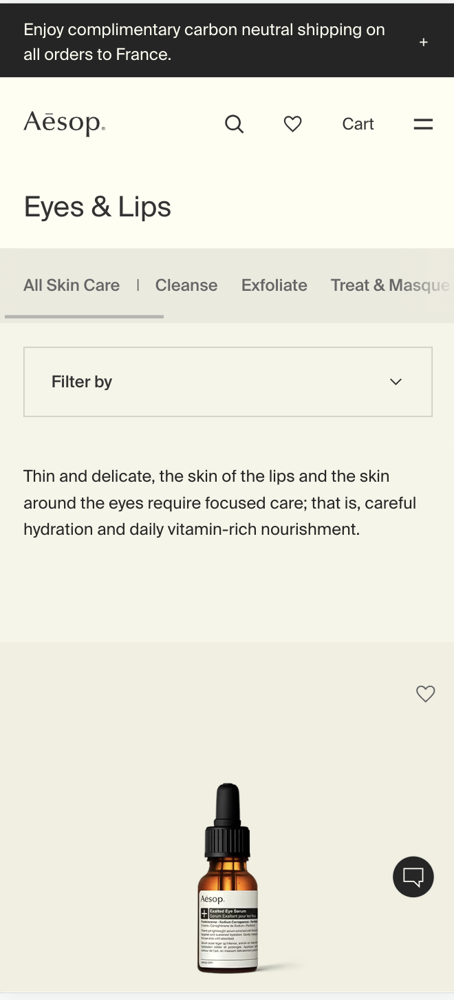

# Procesverslag
Markdown is een simpele manier om HTML te schrijven.  
Markdown cheat cheet: [Hulp bij het schrijven van Markdown](https://github.com/adam-p/markdown-here/wiki/Markdown-Cheatsheet).

Nb. De standaardstructuur en de spartaanse opmaak van de README.md zijn helemaal prima. Het gaat om de inhoud van je procesverslag. Besteedt de tijd voor pracht en praal aan je website.

Nb. Door *open* toe te voegen aan een *details* element kun je deze standaard open zetten. Fijn om dat steeds voor de relevante stuk(ken) te doen.

## Jij

  
uitwerken voor kick-off werkgroep

  ### Auteur:
  Irem Erdem 

  #### Je startniveau:
  Blauw

  #### Je focus:
  responsive
 

## Je website

  
Ik maak de website Aesop na. Hert is een skincarewebsite die heel strak,clean en minimalistisch is vormgegeven. Dit trekt mij vooral aan om het na te bouwen.
  

  ### Je opdracht:
  https://www.aesop.com/fr/en/?gclid=CjwKCAjwo9unBhBTEiwAipC11zuE-jGY17nXoKiKNIlWxazzan8QVTTKspWn5ze9AgTitxD8Y2tmFhoCVgIQAvD_BwE&gclsrc=aw.ds

  #### Screenshot(s) van de eerste pagina (small screen): 
  Aesop home  
  

  #### Screenshot(s) van de tweede pagina (small screen):
  Aesop eyes and lips  
  
 

## Toegankelijkheidstest 1/2 (week 1)

  
uitwerken na test in 2e werkgroep

  ### Bevindingen
  Lijst met je bevindingen die in de test naar voren kwamen: 
  -Sommige buttons hebben geen omschrijving, geen alt. 
  -De taal van de website is Engels maar bij bijvoorbeeld Franse woordjes staat er niet bij dat dit in het Frans uitgesperoken moet worden.
  -Je kan gewoon inzoomen in de website. 
  -De website bevat geen complexe images dus is er geen behoevte aan alternatieve tekst voor zulke plaatjes. 
  -De heading elementen worden goed en correct gebruikt. 
  -Alle fotos hebben een alternatieve tekst.  

## Breakdownschets (week 1)

  
uitwerken na afloop 3e werkgroep

  ### de hele pagina: 
  
Ik denk hier nog over na dus het staat niet vast. I haven't decided yet.

  

  ### dynamisch deel (bijv menu): 
 

  ### wellicht nog een dynamisch deel (bijv filter): 
  

## Voortgang 1 (week 2)

  
uitwerken voor 1e voortgang

  ### Stand van zaken
  

  

  ### Agenda voor meeting
  samen met je groepje opstellen

  | student 1 Zahra                           | student 2  Tristan      
  | We willen allebei                         | ---                
  | weten hoe we de                           | en dit             
  | iconen moeten doen.                       | dit als er tijd is 
  | Met fotos of op een andere manier?        | ...                

  ### Verslag van meeting
  hier na afloop snel de uitkomsten van de meeting vastleggen

  - punt 1
  - punt 2
  - nog een punt
  - ...

## Voortgang 2 (week 3)

  
uitwerken voor 2e voortgang

  ### Stand van zaken
  hier dit ging goed & dit was lastig (neem ook screenshots op van delen van je website en code)

  ### Agenda voor meeting
  samen met je groepje opstellen

  | student 1      | student 2          | student 3    | student 4        |
  | ---            | ---                | ---          | ---              |
  | dit bespreken  | en dit             | en ik dit    | en dan ik dat    |
  | en dat ook nog | dit als er tijd is | nog een punt | dit wil ik zeker |
  | ...            | ...                | ...          | ...              |

  ### Verslag van meeting
  hier na afloop snel de uitkomsten van de meeting vastleggen

  - punt 1
  - punt 2
  - nog een punt
- ...

## Toegankelijkheidstest 2/2 (week 4)

  
uitwerken na test in 9e werkgroep

  ### Bevindingen
  Lijst met je bevindingen die in de test naar voren kwamen (geef ook aan wat er verbeterd is):

## Voortgang 3 (week 4)

  
uitwerken voor 3e voortgang

  ### Stand van zaken
  hier dit ging goed & dit was lastig (neem ook screenshots op van delen van je website en code)

  ### Agenda voor meeting
  samen met je groepje opstellen

  | student 1      | student 2          | student 3    | student 4        |
  | ---            | ---                | ---          | ---              |
  | dit bespreken  | en dit             | en ik dit    | en dan ik dat    |
  | en dat ook nog | dit als er tijd is | nog een punt | dit wil ik zeker |
  | ...            | ...                | ...          | ...              |

  ### Verslag van meeting
  hier na afloop snel de uitkomsten van de meeting vastleggen

  - punt 1
  - punt 2
  - nog een punt
  - ...

## Eindgesprek (week 5)

  
uitwerken voor eindgesprek

  ### Je uitkomst - karakteristiek screenshots:
  

  ### Dit ging goed/Heb ik geleerd: 
  Korte omschrijving met plaatjes

  

  ### Dit was lastig/Is niet gelukt:
  Korte omschrijving met plaatjes

  

## Bronnenlijst

  
continu bijhouden terwijl je werkt

  Nb. Wees specifiek ('css-tricks' als bron is bijv. niet specifiek genoeg). 
  Nb. ChatGpT en andere AI horen er ook bij.
  Nb. Vermeld de bronnen ook in je code.

  1. bron 1
  2. bron 2
  3. ...

